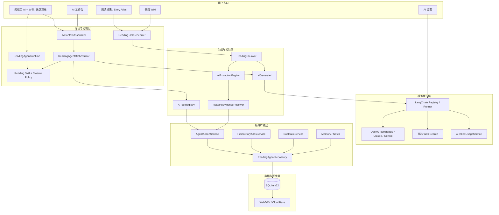

# Anx Reader AI 系统功能地图与处理流程

> 状态：基于当前源码的实现事实与演进建议。更新日期：2026-08-31。
> 适用范围：AI 对话、Reading Agent、Reading Skill、阅读闭环、小说 Story Atlas、书籍 Wiki、阅读记忆、笔记整理、翻译、搜索、模型供应商、Token、任务、证据、同步与撤销。
> 当前 SQLite 版本：22，以 `lib/dao/database.dart` 的 `currentDbVersion` 为准。

## 0. 文档定位与阅读顺序

本文是 AI 子系统的统一入口，回答四个问题：

1. 用户现在能使用哪些 AI 能力？
2. 每项能力从哪里进入，经过哪些服务，是否调用模型、写库和同步？
3. 新功能应该复用哪个架构边界，哪些行为禁止绕过？
4. 当前架构下一步如何收敛为更高复用的流水线？

开发前建议按以下顺序阅读：

1. 本文：AI 全景、流程和复用边界。
2. [`feature-map.md`](feature-map.md)：全项目能力索引和明确未实现项。
3. [`ai-architecture.md`](ai-architecture.md)：当前 AI 运行时的实现细节。
4. [`../../DESIGN.md`](../../DESIGN.md)：低打扰、权限、撤销、剧透和产品交互决策。
5. [`../todo/`](../todo/README.md)：尚未落地的闭环与演进计划。

本文中“已实现”表示可以在当前代码中找到对应入口和数据路径；“建议”表示目标架构，不应被当作已上线能力。

## 1. 系统定位

Anx Reader 的 AI 不是一个调用大模型的按钮，而是围绕阅读现场构建的本地优先系统：

```text
阅读现场
  + 阅读方法（Reading Skill）
  + 成果定义（Closure Policy）
  + 受控工具（Tool）
  + 长任务（ReadingTask）
  + 来源证据（Evidence）
  + 可撤销写入（AgentAction）
  + 可同步产物（Artifact / Wiki / Memory）
  = Reading Agent
```

系统必须维持以下不变量：

- 普通翻页、停留、回看、打开成果页或 Wiki 不调用模型。
- 用户问答可以直接调用模型；主动整理必须由用户点击并确认范围。
- 原文、用户事实、用户反思、AI 推断分层保存。
- 所有 AI 持久写入统一经过 `AgentActionService`，不得绕过撤销日志。
- 所有来源型产物保留章节、位置、原文快照、证据状态和剧透边界。
- 同步不触发模型，不用其他设备最远进度覆盖本设备当前位置。
- 本地/轻量模型失败时不静默把完整正文上传云端。

## 2. 总体架构



### 2.1 分层职责

| 层 | 负责 | 不负责 | 主要代码 |
|---|---|---|---|
| UI/入口 | 收集用户意图、展示预览、确认和结果 | 拼 Prompt、直连 Provider、直写 AI 产物表 | `lib/page/`、`lib/widgets/ai/` |
| Reading Runtime | 阅读现场、稳定位置、事件、目标和低打扰状态 | 主动调用模型、决定领域分析方法 | `reading_agent_runtime.dart` |
| 方法/策略 | 选择阅读方法和成果结构 | 执行写入、管理 Provider | `reading_skills.dart`、`reading_closure_policy.dart` |
| 上下文/编排 | 预算、摘要、共享快照、专家路由和降级 | 保存原始业务产物 | `ai_context_assembler.dart`、`reading_agent_orchestrator.dart` |
| 任务 | 长任务状态、优先级、checkpoint、暂停/恢复/取消 | 在不安全点强杀网络请求或事务 | `reading_task_scheduler.dart` |
| 模型入口 | 生成、fallback、重试、取消、限流、usage | 领域数据校验和持久化 | `index.dart`、`langchain_runner.dart` |
| 分块/证据 | 控制正文大小，把模型证据解析回原文范围 | 猜测无法定位的引用 | `reading_chunker.dart`、`reading_evidence_resolver.dart` |
| 动作/仓库 | 事务写入、前后快照、撤销、冲突保护 | 决定是否应该调用模型 | `agent_action_service.dart`、`reading_agent_repository.dart` |
| 查询投影 | 应用剧透边界并生成页面 ViewModel | 页面交互、模型调用 | `fiction_story_atlas_service.dart`、`book_wiki_service.dart` |
| 同步 | 增量包、设备位置、合并和 tombstone | 触发 AI、自动跳到最远进度 | `lib/service/sync/` |

## 3. AI 功能地图

### 3.1 用户可见能力

| 能力 | 用户入口 | 模型触发 | 主要输入 | 主要输出 | 持久化/同步 | 核心实现 |
|---|---|---|---|---|---|---|
| AI 阅读对话 | 阅读页 AI、AI 工作台 | 用户发送消息 | 当前书、章节、选区、会话、Skill | 流式回答、引用、历史 | AI 会话；按现有规则同步 | `providers/ai_chat.dart`、`widgets/ai/ai_reading_workspace.dart` |
| 选区解释/分析 | 长按选区菜单 | 用户点击动作 | 选区、相邻正文、阅读现场 | 解释、概念或分析 | 可只显示；保存时走动作服务 | `widgets/context_menu/`、AI 工作台 |
| AI 翻译 | 翻译入口 | 用户点击 | 选区/文本、目标语言 | 翻译文本 | 通常不写 Reading Artifact | `service/translate/ai.dart` |
| 深度/专家分析 | AI 工作台复杂问题 | 用户请求且命中策略 | 共享上下文快照、可选搜索 | 压缩 Evidence + 主回答 | trace/history；不直接写业务表 | `reading_agent_orchestrator.dart` |
| Reading Skill | 工作台方法选择、按书固定 | 随请求渐进加载 | 用户意图、书籍模式 | catalog/summary/full 方法指导 | 按书偏好部分仍为设备配置 | `reading_skills.dart` |
| 阅读目标 | Agent/成果页 | 模板无需模型；自然语言解析需模型 | 目标文本或模板 | 单书活跃目标、进度和标准 | SQLite + Reading Agent 同步 | `reading_agent_tools.dart`、repository |
| 来源笔记 | Agent 明确保存命令 | 可能使用当前回答 | 当前选区/明确来源、AI 内容 | 正式笔记、批注、来源 | SQLite + 同步，可撤销 | `AgentActionService.createSourcedNote` |
| 难点保存 | Agent 明确标记 | 不必调用模型 | 当前来源、难点描述 | 新难点或重新打开 | SQLite + 同步，可撤销 | `reading_difficulty_save` |
| Markdown 阅读记忆 | Agent/成果入口 | 写入按请求；召回本地 | 用户反思、来源引用 | Markdown 记忆和主题 | SQLite + 同步，可撤销 | `reading_memory_*`、memory repository |
| 阅读成果 | 阅读成果页 | 打开页面不调用 | 目标、掌握度、问题、卡片、记忆 | 闭环成果投影 | 读取现有数据 | `reading_outcomes_service.dart` |
| 小说故事档案 | 阅读成果 > 整理/更新 | 用户确认后 | 已读章节、覆盖范围、安全边界 | 人物、关系、事件、线索、悬念 | Artifact + 同步，可撤销 | `fiction_backfill_service.dart` |
| 人物档案/关系图 | 故事人物档案 | 打开不调用 | 当前可见 Artifact | 人物即时回忆、局部/完整关系 | 只读投影 | `fiction_story_atlas_service.dart`、图页面 |
| 故事时间线 | 故事时间线 | 打开不调用 | 当前可见事件/场景/线索 | 阶段、人物线、关系变化、悬念线 | 只读投影 | `fiction_story_timeline_page.dart` |
| 书籍 Wiki | 阅读页 Wiki、书籍详情 | 用户确认生成/更新后 | 章节、Artifact、Memory、Evidence | 结构化百科条目和 Markdown 导出 | Wiki 表 + 同步，可撤销/纠正 | `book_wiki_*` |
| 笔记 AI 整理 | 笔记整理入口 | 用户发起 | 已有笔记、标签、主题 | 标题、整理稿、标签、主题建议 | 用户应用后持久化 | `reading_note_ai_organizer_service.dart` |
| 联网核查 | 专家分析/显式搜索 | 用户请求且设置允许 | 查询、可信来源配置 | 搜索结果和实际 URL | 只保存必要引用 | `web_search.dart`、orchestrator |
| Token 用量 | 设置 > AI | 不调用 | runner usage/本地估算 | 月度输入、输出、角色、节省率 | 设备本地诊断数据 | `ai_token_usage_service.dart` |
| 下一阅读行动 | 本书面板、成果页 | 不调用 | Outcomes、现场、Coverage、Atlas、Closure | 唯一首要行动 | 只读临时投影 | `next_reading_action_resolver.dart` |
| 阅读体验诊断 | 开发者设置 | 不调用 | 会话级计数、首尾电量 | 本机体验趋势 | 本机偏好；不备份/同步 | `reading_experience_diagnostics.dart` |

### 3.2 Reading Agent 工具

| 工具 | 类型 | 权限与来源约束 | 写入边界 |
|---|---|---|---|
| `current_reading_metadata` | 查询 | 当前阅读会话 | 无写入 |
| `current_book_toc` / `current_chapter_content` / `chapter_content_by_href` | 查询 | 当前书合法章节 | 无写入 |
| `book_content_search` | 查询 | 当前书全文索引 | 无写入 |
| `bookshelf_lookup` / `bookshelf_organize` | 查询/动作 | 用户启用的书架工具 | 复用书架服务 |
| `notes_search` / `reading_history` / tags 工具 | 查询/动作 | 本地数据和工具启用列表 | 动作遵守原服务约束 |
| `calculator` / `current_time` / `mindmap_draw` | 通用 | 无阅读写入权限 | 结果型能力 |
| `reader_navigate` | 导航 | 仅当前书合法 CFI/Href | 不入撤销日志，保留返回位置 |
| `reading_note_create` | 持久动作 | 必须有当前选区或明确有效来源 | `AgentActionService` |
| `reading_difficulty_save` | 持久动作 | 沿用去重/重新打开规则 | `AgentActionService` |
| `reading_goal_set` | 预览/持久动作 | 先产生结构化预览，确认后写入 | `AgentActionService` |
| `reading_memory_append` / `reading_memory_recall` | 持久/查询 | 来源与用户反思分层 | 写入走动作服务 |
| `fiction_artifact_save` / `fiction_character_recall` | 持久/查询 | 当前书、剧透边界、来源 | 写入走动作服务 |

### 3.3 触发级别

| 级别 | 场景 | 是否允许模型 | 是否允许打断用户 |
|---|---|---:|---:|
| L0 本地静默 | 翻页、停留、回看、稳定位置、章节切换、页面加载、同步 | 否 | 否 |
| L1 用户即时请求 | 对话、翻译、解释、搜索 | 是 | 用户已主动打开界面 |
| L2 用户确认任务 | 故事整理、Wiki、全书处理、主动回填 | 确认范围后允许 | 只显示任务进度，不在普通阅读中弹出 |
| L3 内部派生任务 | 滚动摘要、主题提取 | 仅已有 AI 会话/任务触发；不可用则延后 | 否 |
| L4 Agent 主动建议 | 画像候选、章节回顾建议 | 只生成建议，不自动写入 | 只进入胶囊/待处理数量 |

## 4. 端到端处理流程

### 4.1 普通问答与选区解释

```text
用户提交问题/选区动作
  -> AiChat 捕获 ReadingWorldState
  -> ReadingSkillMatcher 选择并渐进加载方法
  -> AiContextAssembler 去重、读取缓存摘要、应用任务预算
  -> ReadingAgentOrchestrator 判断直接回答或专家分析
  -> aiGenerateStream
  -> LangChainRunner 选择 Provider、排队、限流、重试、fallback
  -> Token Usage 记录最终发送的输入和输出
  -> 流式结果写入会话历史并展示
```

关键点：本地保存完整会话；预算只作用于发送给模型的副本。最新用户消息不能被静默摘要或截断。

### 4.2 专家编排

```text
复杂任务
  -> 生成一次共享上下文快照
  -> 最多并行两个专家
  -> 每个专家使用独立预算
  -> 输出解析为 EvidenceObject
  -> 压缩主张、依据、不确定性、置信度和真实 URL
  -> 主助手基于压缩证据回答
```

单个专家失败、搜索失败或 JSON 失败时降级，不阻塞其他专家和主回答；没有真实搜索结果时不得制造 citation。

### 4.3 Reading Runtime 与低打扰闭环

```text
进入阅读页
  -> 恢复 ReadingWorldState / 目标 / Profile / Coverage
  -> sessionStarted
  -> 原始翻页仅留内存
  -> 750ms 稳定位置去抖与去重
  -> locationSettled / chapterChanged
  -> 本地更新目标进度和 checkpoint
  -> 控制栏可见且有状态时更新胶囊
退出阅读页
  -> 保存本地进度
  -> sessionEnded
```

这条链路不连接 Provider。章节结束只增加待处理数量，用户点开后才可能创建回顾任务。

### 4.4 Agent 持久动作与撤销

```text
明确用户指令或已确认建议
  -> Tool 校验 Beta、当前书、来源和参数
  -> 构造业务对象
  -> AgentActionService
  -> Repository 事务：业务写入 + before/after snapshot + action log
  -> Runtime 发布 agentActionApplied
  -> Snackbar/动作记录提供 undo
  -> undo 校验幂等与后续修改冲突
```

导航是非持久动作，不进入动作日志。Agent 主动推断不能直接执行持久写入。

### 4.5 小说 Story Atlas 整理

`ReadingStructureParser` 是 Story Atlas 的内容准入边界：先排除版权、扉页、
版本/编校说明等出版元信息，再把普通章/节/回视为 scene。是否按当前案件 arc
过滤由 `BookReadingProfile` 的 suspense/case facet 声明；页面不得自行根据书名
或章节标题切换作用域。结构化事件/关系通过证据校验后若引用了尚未建档的人物，
仍须由同一确定性校验层找到逐字身份或出场证据，才能补齐 character Artifact。

```text
用户点击“整理/更新故事档案”
  -> 预览当前设备整理范围和 Token
  -> 用户确认
  -> ReadingTaskScheduler 创建/恢复 fiction.backfill
  -> ReadingStructureParser 划分 work / volume / arc / scene
  -> ReadingChunker 对长章节分块
  -> 本地/轻量模型提取候选，或经确认使用通用模型
  -> 确定性人物归一、关系类型、去重和作用域校验
  -> ReadingEvidenceResolver 把证据定位回原章节
  -> 只将通过校验的结果变为 ReadingArtifact
  -> AgentActionService 分批写入
  -> 内容哈希 checkpoint
  -> FictionStoryAtlasService 生成页面 ViewModel
```

整理上限使用当前设备当前位置，不使用多设备全局最远进度。`workId -> volumeId -> arcId -> sceneId` 防止合集、分册和案件互相污染。

### 4.6 书籍 Wiki

```text
打开 Wiki
  -> BookWikiService 读取已有 Entry + Artifact + Markdown Memory
  -> 应用 visibleFromProgress
  -> 只读展示，不调用模型

用户点击“生成/更新”
  -> 已读范围/全书二次确认
  -> wiki.book_generate ReadingTask
  -> 章节分块、内容哈希跳过
  -> 模型生成结构化 Entry
  -> Evidence Resolver 校验来源和范围
  -> AgentActionService 写 Wiki / Entry / Source / Revision
  -> BookWikiService 重新投影
```

全书模式允许处理未读内容，但不自动扩大本地默认可见边界。用户纠正的版本优先于后续自动生成。

### 4.7 本地＋线上混合提取

```text
完整正文
  -> AiExtractionEngine 选择设备本地/云端轻量 Provider
  -> 候选人物、关系、事件、证据
  -> 确定性规则与 Evidence Resolver
  -> 高置信文本事实直接接受
  -> 仅疑难候选 + 短证据交给通用模型复核
  -> accept / reject / normalize
  -> 正式 Artifact
```

当前轻量引擎角色包括：`fiction.story_atlas`、`context.rolling_summary`、`reading_memory.topic_extraction`。它是候选提取器和证据筛选器，不是最终事实源。未配置或不可用时，明确整理任务必须询问用户是否使用通用云模型；内部摘要只延后。

### 4.8 滚动上下文摘要

```text
用户已经发起 AI 对话
  -> ContextAssembler 识别超出最近窗口的旧消息
  -> 检查会话/消息/Provider/模型/版本缓存
  -> 可用的提取引擎异步压缩旧消息
  -> 保存缓存摘要
  -> 当前请求或后续请求读取摘要 + 最近消息
```

摘要不能由普通阅读事件触发；提取引擎不可用时保留最近消息并延后，不把完整旧消息静默发送到备用云模型。

### 4.9 笔记整理、翻译与联网核查

- 笔记整理：收集允许的 source/topic ID，模型返回建议，解析器验证 ID、数量、标签和 JSON；只有用户应用建议后才修改笔记。
- 翻译：使用 `AiContextTask.translation` 的独立预算，通过统一 `aiGenerate*` 入口执行和计量。
- 联网核查：只有设置允许并且任务需要时调用；真实 URL 才能进入 Evidence，失败时退回书内上下文分析。

### 4.10 同步

```text
本地 SQLite 变更
  -> ReadingAgentSyncService 按书/设备捕获增量
  -> WebDAV 或 CloudBase transport
  -> 下载其他设备包
  -> 稳定 ID / 时间 / 状态 / tombstone 合并
  -> 恢复本设备当前位置
  -> 必要时提示“继续当前位置 / 跳转最远进度”
```

同步只传数据，不执行 Prompt、模型或长任务。其他设备进度不会覆盖本机位置；全局最远进度只用于用户主动选择。

阅读状态额外经过 `ReadingActivityCoordinator`：

```text
activeReading + 自动同步
  -> 合并为一个 pending intent，不发网络请求
退出/后台
  -> 保存位置、Runtime、阅读时长
  -> flush 一次 pending intent
离线/非 Wi-Fi
  -> 保留一个 intent，不循环重试
用户手动同步
  -> 立即进入 SyncRequestGate，重复点击复用同一 Future
```

自动冲突不弹方向选择框，只在“本书”面板显示需要手动处理。远端最远进度按
设备位置指纹在每个阅读会话最多自动提示一次，默认保持本机当前位置。

### 4.11 本书面板与下一行动

阅读页不再为 Wiki、成果、Story Atlas 和同步提供重复一级入口。`AI` 负责当前
帮助，`本书` 负责书级状态。手机使用底部 Sheet，宽屏使用侧边面板；面板打开只
读取现有投影，不调用模型。

```text
ReadingOutcomesSnapshot + ReadingWorldState + Coverage + Story Atlas
  -> NextReadingActionResolver
  -> Closure Policy.nextActionOrder
  -> 唯一 NextReadingAction
  -> 本书面板 / 成果页共用
```

`NextReadingAction` 不存库、不进入同步；`completionFingerprint` 只用于识别投影
是否变化和本机诊断。新 Closure 只声明行动顺序，不修改阅读页或成果页。

## 5. 模型角色、Provider 与预算

### 5.1 模型角色

| 角色 | 默认用途 | 正文可见范围 | 失败策略 | Token 统计角色 |
|---|---|---|---|---|
| 通用模型 | 对话、用户可见总结、确认后的完整整理 | 用户请求/确认范围 | 可按设置 fallback | `general` |
| 本地候选提取器 | 小说候选、内部摘要、记忆主题 | 用户确认的输入；不出设备 | 失败即延后或询问 | `localExtraction` |
| 云端轻量提取器 | 与本地提取器相同 | 用户配置并确认的范围 | 不冒充本地隐私边界 | `cloudExtraction` |
| 线上疑难复核 | 复核冲突、别名、隐含关系 | 只接收候选与短证据 | 失败保留高置信结果 | `cloudVerification` |

Provider 支持 OpenAI-compatible、Claude/Anthropic 和 Gemini 协议。自定义 OpenAI-compatible Provider 可配置 `authMode=none`；内置云 Provider 仍要求 Key。部署位置使用 `localPrivate/cloud` 区分隐私提示和 Token 口径。

### 5.2 上下文任务预算

`AiContextAssembler` 当前声明：

```text
general / readingChat / translation / chapterReview / fictionBackfill
noteOrganizer / expertAnalysis / lightweightExtraction
cloudVerification / internalSummary
```

每类任务分别控制输入上限、预留输出、最近消息数和摘要预算。调用方必须传入最接近的任务类型，不能用 `general` 掩盖长文本任务。

### 5.3 Token 与观测口径

- 服务端 usage 优先，缺失时本地估算并标记。
- 失败重试和 fallback 均应计入实际消耗。
- 本地提取显示“避免的线上主模型输入”；云端小模型 Token 单独统计，不能把低价格称为 Token 变少。
- 月度用量是设备本地诊断数据，不参与多设备合并，也不是供应商账单。

## 6. 数据、来源与真相层

### 6.1 数据分层

| 层 | 示例 | 真相性质 | 是否允许 AI 覆盖 |
|---|---|---|---:|
| 原始内容 | EPUB 章节、选区、原文快照 | 书籍来源事实 | 否 |
| 用户事实 | 明确目标、用户纠正、固定偏好 | 用户确认事实 | 否 |
| 用户反思 | Markdown Memory、笔记、应用体会 | 用户表达 | 否 |
| AI 候选 | 未校验人物/关系/主题 | 中间产物 | 可丢弃，不应直接展示为事实 |
| Evidence | 原文范围、真实 URL、置信度 | 支撑对象 | 只能由解析器确定或真实检索产生 |
| Artifact | 人物、关系、事件、线索、悬念 | 文本事实或 Agent 推断 | 可撤销/隐藏，不覆盖用户纠正 |
| Wiki Entry | Artifact/Memory/章节的百科投影 | 派生成果 | 按版本更新，保留 Revision |
| Agent Action | before/after、状态、期限 | 审计与撤销依据 | 只追加状态，不伪造历史 |

### 6.2 来源字段

所有来源型成果应尽量收敛到以下语义：

- `bookId`、`chapterHref`、`chapterTitle`、CFI 或字符 offset。
- `sourceTextSnapshot`：创建时的原文快照。
- `sourceProgress`：内容在书中发生/出现的位置。
- `visibleFromProgress`：读到哪里后允许显示。
- `ingestedAt`：数据何时进入系统。
- `ingestionMode`：`live/backfill/imported/synced`。
- `createdBy`、`epistemicStatus`：用户、系统或 Agent；文本事实或推断。
- pipeline/prompt/model/version：便于失效、诊断和重放。

`sourceProgress`、`visibleFromProgress` 和 `ingestedAt` 不能重新合并为一个“发现进度”。

### 6.3 主要持久化域

当前 SQLite v22 的 AI/Reading Agent 数据包括：

- AI 会话：`tb_ai_sessions`。
- 目标、checkpoint、mastery、难点和知识卡。
- Reader Profile、BookReadingProfile 和阅读覆盖/设备位置。
- Markdown Memory、来源和主题。
- Reading Artifact、Reading Task、Agent Action 和 tombstone。
- Book Wiki、Entry、Source 和 Revision。
- 正式笔记、批注及 AI 整理相关数据。

ReadingChunk 是短生命周期中间对象，不持久化完整 chunk 正文；任务 checkpoint 只保存恢复所需元数据。

## 7. Reading Skill、Closure、Tool、Profile 的边界

| 概念 | 回答的问题 | 扩展方式 | 禁止事项 |
|---|---|---|---|
| Reading Skill | 用什么阅读方法？ | 注册 catalog/summary/full、匹配规则和文案 | 不能当工具集合、不能直接写库 |
| Closure Policy | 什么算本书的阅读成果？ | 稳定 ID + 目标/checkpoint/mastery/Section/快捷问题声明 | 不直接发模型请求 |
| Tool | Agent 能执行什么？ | registry 中注册 schema、权限、校验和 handler | 持久动作不能绕过 ActionService |
| BookReadingProfile | 这本书适用什么主闭环和内容特征？ | 稳定 facet、置信度和用户固定 | 不替代 Skill，不在页面硬编码书类 |
| Reading Structure | 书内作用域如何划分？ | work/volume/arc/scene 与类型策略 | 不依赖不稳定显示名称作为唯一 ID |

已有闭环：`fiction.immersion`、`knowledge.argument`、`psychology.reflection`。已有 Reading Skill 包括苏格拉底教学、论证拆解、历史核查、小说人物追踪、学术批判、外语语境、财务假设、章节回顾、考试复习和阅读到行动。

## 8. 当前架构评价

### 8.1 已形成的强边界

1. 模型调用基本收敛到 `aiGenerate* -> LangChainRunner`，供应商和业务解耦。
2. `AiContextAssembler` 已具备任务预算、最近消息、滚动摘要、去重和缓存。
3. `ReadingTaskScheduler` 已具备持久状态、优先级、协作式抢占和恢复安全点。
4. `AgentActionService` 已成为目标、笔记、难点、记忆、Artifact、Wiki 等写入的撤销边界。
5. `ReadingChunker + ReadingEvidenceResolver` 已提供长文本处理和来源安全的公共底座。
6. `FictionStoryAtlasService` 与 `BookWikiService` 将页面从 DAO 和原始字段中隔离。
7. 稳定字符串 ID、BookReadingProfile 和声明式 Closure 已为新书类保留扩展口。
8. 本地候选提取、线上复核和 Token 分角色统计已具备混合模型基础。

### 8.2 当前复用风险

以下是从代码结构推导出的演进风险，不代表当前功能不可用：

- `aiGenerateStream`、`aiGenerateText`、`aiGenerateTextWithMetadata` 的参数继续增长时，调用方容易遗漏 task、fallback、角色或来源元数据。
- 长任务调度器已有 executor 注册能力，但 Story Atlas 与 Wiki 的任务构造、恢复和 UI 进度仍由阅读页分别编排，新增任务容易复制流程。
- 专家 `EvidenceObject`、`ReadingEvidenceResolution`、Artifact 来源和 Wiki Source 语义接近但模型不同，跨流水线复用需要手工转换。
- 结构化生成普遍重复“Prompt -> JSON -> 校验 -> 来源 -> 写入”，但尚无统一的声明式 Pipeline。
- Provider 当前描述协议、认证、部署位置和模型，但 JSON、工具、流式、视觉、上下文长度、thinking 等能力仍主要由调用方假设。
- 部分按书 AI 模式、Skill、Closure 和分析设置仍保存在 SharedPreferences，和可同步的 BookReadingProfile 并存。
- 页面仍承担一部分章节收集、Token 预估、模型 fallback 确认和任务 executor 组装，领域服务边界还可继续上移。
- Token、trace、task、action 和 source coverage 分散，难以用同一个 request/task ID 完整追踪一次整理。

## 9. 高复用目标架构

### 9.1 统一请求对象

已用不可变的 `AiRequest` / `AiResponseMetadata` 收敛公共入口参数：

```dart
AiRequest(
  workloadId: 'fiction.story_atlas',
  messages: messages,
  contextTask: AiContextTask.fictionBackfill,
  providerRole: AiProviderRole.general,
  fallbackPolicy: AiFallbackPolicy.confirmBeforeFullTextCloud,
  sourceScope: AiSourceScope(bookId, boundary, chapterRefs),
  outputContract: AiOutputContract.json(schemaVersion: 3),
  trace: AiTraceContext(requestId, taskId, sessionId),
)
```

收益：调用方无法忘记预算、隐私、fallback、输出协议和追踪字段；三个 `aiGenerate*` 可以保留为兼容 facade。

### 9.2 统一 ReadingPipeline

建议把重复的结构化任务收敛为可组合阶段：

```text
collect -> scope -> budget -> chunk -> generate -> parse
        -> normalize -> validate -> resolve evidence
        -> persist -> project -> observe
```

每个业务只注册差异：

- `workloadId` 和 pipeline version。
- 输入范围与剧透策略。
- chunk 策略。
- Prompt/JSON schema。
- 规范化器和验证器。
- Artifact/Wiki/Memory 映射器。
- 写入权限与同步策略。

Story Atlas、Wiki、笔记整理、内部摘要和记忆主题可共享同一个执行骨架，不共享错误的领域规则。

### 9.3 Descriptor + Registry

建议将以下扩展点统一为稳定 descriptor：

| Registry | Descriptor 最小字段 |
|---|---|
| Provider | protocol、auth、deployment、capabilities、limits、thinking、usage |
| Skill | id、catalog、summary、full、matcher、closure contributions |
| Closure | id、goals、checkpoints、mastery、sections、quick prompts |
| Tool | name、schema、permission、source requirement、handler |
| Task | type、priority、persistence、executor factory、checkpoint version |
| Pipeline | workloadId、stages、budgets、output schema、fallback、version |
| Artifact/Wiki projection | kind、parser、normalizer、ViewModel mapper、unknown policy |

注册一个新书类或任务时，核心阅读页和成果页不应增加条件分支。

### 9.4 统一 Evidence Envelope

已在不破坏现有模型的前提下引入共享 `EvidenceEnvelope`：

```text
evidenceId
book/chapter/cfi/offset/url
exactText
sourceProgress / visibleFromProgress
matchStrategy / confidence
epistemicStatus
producer / model / pipelineVersion
```

专家 Evidence、ReadingEvidenceResolution、Artifact 来源和 Wiki Source 通过适配器映射到它。业务实体继续保留自己的 payload，证据语义只维护一份。

### 9.5 统一写入命令

所有 AI 持久产物使用：

```text
ValidatedAiMutation
  -> permission check
  -> source/evidence check
  -> AgentActionService transaction
  -> sync capture
  -> projection invalidation
  -> action/trace completion
```

这可以减少每个新 Artifact/Wiki/Memory 功能重复实现确认、事务、undo 和同步失效逻辑。

### 9.6 统一可观测性

一次 AI 工作应贯穿同一组关联 ID：

```text
requestId -> taskId -> sessionId -> bookId -> actionId -> artifact/entry IDs
```

统一记录 provider、model、execution location、input/output Token、估算标记、耗时、重试、fallback、chunk、覆盖范围、校验拒绝数和最终产物数。日志不能记录 Key 和无必要的完整正文。

## 10. 演进优先级与完成标准

### P0：公共契约（1.16.0 已落地）

1. 已新增 `AiRequest`、`AiResponseMetadata` 和 fallback/privacy policy；现有 API 保留为适配层。
2. 已新增 Provider capability descriptor：JSON、tools、streaming、vision、context、thinking、local/cloud。
3. 已统一 `EvidenceEnvelope`，并为正文解析、Artifact、Wiki、笔记和专家证据提供 adapter。
4. 已定义 `ValidatedAiMutation`；目标、笔记、难点、记忆、Profile、Artifact、Wiki 写入均经过统一授权与来源边界校验，再进入动作事务。
5. 所有新模型请求生成 `requestId`，并将 workload/provider/model/Token/重试/fallback 元数据贯通 runner 日志。

完成标准：新增一个结构化 AI 请求不需要自行选择 Provider、不需要自行统计 Token，也不能绕过来源和 fallback 策略。以上契约测试已覆盖。

### P1：统一任务与流水线

1. 建立 `ReadingTaskDescriptorRegistry` 和 executor factory。
2. 把阅读页中的 Story Atlas/Wiki task executor 组装迁入领域服务。
3. 建立 `ReadingPipeline` 阶段协议和统一进度 ViewModel。
4. 统一 retry/shrink/fallback/pause/ask-user 失败策略。
5. 将 Story Atlas 和 Wiki 迁移为首批 pipeline，使用契约测试锁定行为。
6. 将按书 Skill/模式/Closure 配置逐步迁移到可同步数据库，保留旧配置迁移层。

完成标准：新增一个长文本任务只需注册 descriptor、领域 schema、校验器和映射器；页面只负责选择范围、确认和订阅进度。

### P2：统一知识投影与跨设备任务

1. 建立 Artifact/Wiki/Memory 的通用只读投影协议和缓存失效机制。
2. 增加 pipeline version 迁移、结果失效和可重放诊断。
3. 设计跨设备任务状态的保守合并；默认不在另一设备自动恢复云任务。
4. 细化章节/片段哈希缓存，避免同一正文被不同功能重复分块和计数。
5. 增加可选价格配置，在 Token 之外展示明确标注的估算成本。
6. 将领域类型策略插件化，但保持未知类型可同步、可忽略、无页面崩溃。

完成标准：同一来源可以被 Story Atlas、Wiki、Memory 复用而不重复提取；pipeline 版本升级可以解释哪些结果需要失效和重建。

## 11. 扩展指南

### 新增 AI 功能

1. 确定触发级别 L0-L4；普通阅读路径不得越过 L0。
2. 选择现有 `AiContextTask` 或明确新增预算类别。
3. 使用 `aiGenerate*` / `AiExtractionEngine`，不得在页面创建模型客户端。
4. 长任务使用 `ReadingTaskScheduler` 和 checkpoint。
5. 长文本使用 `ReadingChunker`；来源型输出使用 `ReadingEvidenceResolver`。
6. 持久写入使用 `AgentActionService`，声明 undo、冲突和同步规则。
7. 页面通过服务 ViewModel 读取，应用 `visibleFromProgress`。
8. Token、失败、fallback 和隐私行为进入测试与文档。

### 新增书类

1. 使用稳定 namespaced string ID。
2. 注册 `BookReadingProfile` facet、Closure 和默认 Story/Wiki 投影。
3. 复用 work/volume/arc/scene 作用域，不在阅读页写类型分支。
4. 未知 Artifact/Wiki kind 必须可同步并安全忽略。
5. 加入“注册假的第四种类型时页面无需修改”的契约测试。

### 新增 Provider

1. 在 registry/runner 适配协议和认证。
2. 声明部署位置和能力，不让业务猜测模型特性。
3. 复用请求队列、RPM、超时、取消、Key 轮换和 usage。
4. 不把 Key、完整 Prompt 或正文写入日志、Artifact 和同步包。

### 新增 Tool

1. 注册稳定名称和 JSON schema。
2. 声明查询、导航、预览或持久动作。
3. 校验当前书、来源和 Beta/用户权限。
4. 持久动作只调用 `AgentActionService`。
5. 添加无效来源、禁用状态和重复调用测试。

## 12. 测试与验收矩阵

| 维度 | 必测内容 |
|---|---|
| 静默阅读 | 连续翻页、停留、回看、打开成果/Wiki 不产生模型请求 |
| 上下文 | 预算、最新消息保留、摘要缓存/失效、Skill/Closure 去重 |
| Provider | 协议、无 Key 本地 Provider、fallback、取消、超时、usage |
| 长任务 | checkpoint、暂停、恢复、取消、进程重启不自动调用云模型 |
| 来源 | exact/normalized 匹配、越界拒绝、证据不存在时不写入 |
| 剧透 | 后文 Artifact/Wiki 在早期位置隐藏；同步不扩大默认边界 |
| 写入 | 明确指令、建议确认、事务、幂等 undo、后续修改冲突 |
| 小说 | 作品/分册/案件/场景隔离、别名归一、增量去重、当前案件投影 |
| Wiki | 已读/全书权限、hash 跳过、用户纠正优先、Markdown 来源 |
| 同步 | per-device 位置、tombstone、稳定 ID 合并、不触发模型 |
| Token | 服务端/估算、角色分组、重试、fallback、混合节省口径 |
| 扩展性 | 假 Provider/Skill/Closure/Artifact/第四书类注册契约 |
| 阅读体验 | AI＋本书入口、唯一行动、自动同步合并、离线 pending、E-INK 无循环动画、诊断不出设备 |

## 13. 关键代码索引

| 主题 | 路径 |
|---|---|
| 模型公共入口 | `lib/service/ai/index.dart` |
| Provider registry/runner | `lib/service/ai/langchain_registry.dart`、`langchain_runner.dart` |
| 上下文预算 | `lib/service/ai/ai_context_assembler.dart` |
| Token | `lib/service/ai/ai_token_usage_service.dart` |
| 轻量提取 | `lib/service/ai/ai_extraction_engine.dart`、`fiction_hybrid_extraction_service.dart` |
| 对话/工作台 | `lib/providers/ai_chat.dart`、`lib/providers/ai_workspace.dart`、`lib/widgets/ai/` |
| Reading Runtime | `lib/service/ai/reading_agent_runtime.dart` |
| 专家编排 | `lib/service/ai/reading_agent_orchestrator.dart` |
| Skill/Closure/Profile | `reading_skills.dart`、`reading_closure_policy.dart`、`reading_experience_profile_service.dart` |
| Tools | `lib/service/ai/tools/` |
| Task | `lib/models/reading_task.dart`、`lib/service/ai/reading_task_scheduler.dart` |
| 动作/仓库 | `agent_action_service.dart`、`reading_agent_repository.dart` |
| 分块/证据 | `reading_chunker.dart`、`reading_evidence_resolver.dart` |
| 小说结构/档案 | `reading_structure_parser.dart`、`fiction_backfill_service.dart`、`fiction_story_atlas_service.dart` |
| Wiki | `book_wiki_service.dart`、`book_wiki_generation_service.dart`、`book_wiki_export_service.dart` |
| 阅读记忆 | `reading_memory_repository.dart`、Reading Agent memory tools |
| 笔记整理 | `lib/service/reading_note/reading_note_ai_organizer_service.dart` |
| 翻译/搜索 | `lib/service/translate/ai.dart`、`lib/service/ai/web_search.dart` |
| 数据库 | `lib/dao/database.dart` |
| 同步 | `lib/service/sync/` |
| 阅读活动协调 | `lib/service/sync/reading_activity_coordinator.dart` |
| 本书统一面板 | `lib/widgets/reading_page/reading_book_hub.dart` |
| 下一阅读行动 | `lib/models/next_reading_action.dart`、`lib/service/ai/next_reading_action_resolver.dart` |
| 阅读体验诊断 | `lib/service/reading_experience_diagnostics.dart`、`lib/page/settings_page/developer/reading_experience_diagnostics_page.dart` |

## 14. 开发检查清单

- 这是 L0、L1、L2、L3 还是 L4 触发？
- 是否复用了 `aiGenerate*`、ContextAssembler 和统一 runner？
- 是否声明了任务预算、模型角色和 fallback/隐私策略？
- 长文本是否分块，模型证据是否能解析回原文？
- 是否区分用户事实、用户反思、文本事实和 Agent 推断？
- 是否保持 `sourceProgress`、`visibleFromProgress`、`ingestedAt` 分离？
- AI 写入是否有确认、Action snapshot、幂等撤销和冲突保护？
- 新数据是否有同步、tombstone 和未知类型策略？
- 页面是否只消费服务 ViewModel，而非 DAO/Prompt/Provider？
- 普通阅读和页面加载是否仍然零模型调用？
- Token、重试、失败、耗时和产物数量是否可观测？
- 是否更新本文、功能地图、相关架构文档和契约测试？
